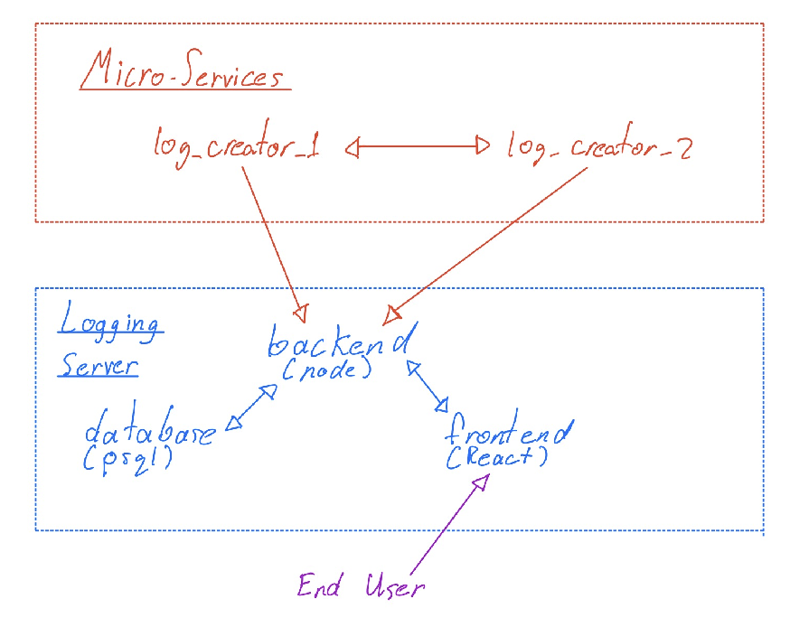

# TeamRocket
CSC302  - Team Rocket blasting off again

## Documentation
> Please consult the [`documentation`](/documentation) subdirectory for our progress, roadmap, meeting minutes, tech stack and more.

## Installation and Deployment
### Quick Start Guide
- Clone the repository
- Go into the directory created by cloning the repository
- run `./bootstrap.sh` to install the required dev dependencies
- run `./run_app.sh`, this should start the entire docker stack and print output to the console

### Test Guide 
- Clone the repository
- run `./bootstrap.sh` if haven't done so already
- run `./run_tests.sh`

## Dev Dependencies installed by bootstrap.sh
* Node 16
* npm 7.24.0
* Docker 20.10
* psql 14

## Architecture

### Architecture

Our entire stack is running on the same host, logically separated by containers. This allows easily reproduce builds, but more importantly allows easy networking and coordination of all the services running at once.
`docker-compose up` is much easier than starting 5 services. 

The 2 microservices are meant to imitate multiple services that would be running in production. This is a super simple example architecture.
In reality, these microservices would be much more complex, the interactions would be more complex, they would be running on different machines while these are running on same host with docker.

The backend service is made up of 3 parts. Backend, database, and frontend. While we showed that the end user would be interacting with the frontend only can stil programmatically interact with the backend through the API. The frontend is just a simple visual wrapper on that API.

### log_creator
`log_creator` is a node application that creates dummy logs.
The docker-compose creates 2 of these services, and they ping each other back and forth imitating microservices.
These services don't have a database to keep complexity down but in real world use each microservice should have it's own database.

### logging_server

#### client
This is our frontend react application, it adds a very simple GUI on top of the logging server.

#### server
This is the backend server that handles the actual log capturing, filtering, and where the API is exposed.
